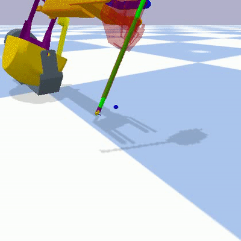
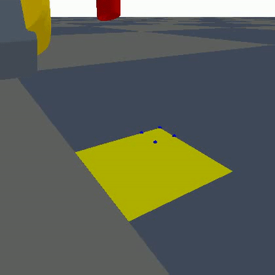

# COSUR 2024 - Reinforcement Learning for Robot-Assisted Surgery
This repository contains the code for the practical lab part of the Reinforcement Learning for Robot-Assisted Surgery part of the
[cosur: summer school on control of surgical robots](https://metropolis.scienze.univr.it/cosur-2024/) -
dvrk from zero to hero held 15-18 July 2024 – Verona, Strada Le Grazie 15, ITALY.

## Getting Started
1. Install Conda
```bash
wget https://repo.anaconda.com/miniconda/Miniconda3-latest-Linux-x86_64.sh
bash Miniconda3*.sh
conda init
```

2. Create a Conda environment
```bash
conda create -n cosur_rl python=3.10
conda activate cosur_rl
```

3. Install the dependencies of this repo
```bash
pip install -r requirements.txt
```

4. Test the installation
```bash
python3 cosur/dvrk_point_reach_env.py
```

## Your TODOs for the summer school

### Point Reaching Task
The goal of point reaching is to control the 7 joints of the PSM to reach a target position and orientation with the end-effector.
Effectively learning free motion path planning and the inverse kinematics.



A good way to start learning how to apply reinforcement learning to robotic tasks is building your own environments.
I realize that point reaching is not a very exciting task (and should be solved with traditional path planning and IK methods), but
the task strikes a nice balance between complicated (a human would struggle controlling the joints manually) and learnable (does not take hours to train).
The file `src/dvrk_point_reach_env.py` contains an unfinished implementation
of a reinforcement learning training environment to learn a point reaching task for a dVRK PSM.
The open TODOs will show you the essential components of a reinforcement learning environment that adhers to the Gym(nasium) standard.
The environment uses PyBullet as its physics engine.

#### Task Overview:
1. In the `step` function, implement the logic for the different action types.
2. Define the action space in the `__init__` function.
3. Implement the `get_observation function`.
4. Define the observation space in the `__init__` function.
5. Implement the `calculate_reward_features` function.
6. In the `step` function, define when the episode is done.
7. Define the `reward_feature_weights`.
8. In the `step` function, add information that you want to monitor during training to the `info` dictionary.
9. Implement the `sample_target_position` function. Why is it important to randomly sample target positions?
10. Implement the `sample_target_orientation` function. Why is it important to randomly sample target orientations?
11. In the `reset` function, implement the randomization of the initial joint values. Why is it important to randomize the initial joint values?
12. Find appropriate values for the `STANDARDIZATION_VALUES`. Why is it important to standardize the observations?

All the steps are marked with a `TODO` at the appropriate locations.

#### Reinforcement Learning
The file `src/sb3_ppo.py` contains code to use [stable baselines 3](https://github.com/DLR-RM/stable-baselines3) to train an agent on the point reaching env.
Depending on your implementation of the env, you will want to adjust some of the configurations (also marked as `TODO` in the file.)
You can run a training with `python3 src/sb3_ppo.py` and monitor the training results with `tensorboard --logdir runs`.

The file `src/cleanrl_ppo.py` contains the PPO training script from [cleanRL](https://github.com/vwxyzjn/cleanrl) which is a bit nicer to follow along.
If you want to step through the PPO algorithm to understand what is going on, refer to this script. However training will probably be too slow.


### Tissue Retraction Task (Optional)
The goal of tissue retraction is to control the 7 joints of the PSM to grasp and retract tissue to visualize an occluded area of interest.
Learns a multi-phased task, the task-driven path planning, and the inverse kinematics.

This task is much more complicated, depending on how much information you assume to know about the state and goal of the environment.
If you know both where the tissue should be grasped, and to where it should be retracted, the task boils down to a point reaching task.
If you only know, that the occluded area should be made visible, the agent will have to figure out much more than just going to positions that are known in advance.
Learning this task will take probably much more time than what we have during the lab session, so this task is seen as optional.
You can use it as inspiration and starting point, if you want to continue on your own.
The file `src/dvrk_tissue_retraction_env.py` contains an unfinished implementation



#### Task Overview:
1. Randomize the cloth position and rotation
2. Implement reward function
3. Implement done condition
    1. Occluded point becomes visible. Could be done using the segmentation image
    2. Cloth corner is at a target position
    3. First go to a target position, then grasp the cloth, then go to another target position. Grasp point could be the closest index over the target position. Retraction target could be above the attachment points.


## Acknowledgements
- PSM and ECM mesh files and URDF files from [https://github.com/WPI-AIM/dvrk_env](https://github.com/WPI-AIM/dvrk_env)
- The cloth mesh files and inspiration for grasping deformable objects from [https://github.com/DanielTakeshi/deformable-ravens](https://github.com/DanielTakeshi/deformable-ravens)
